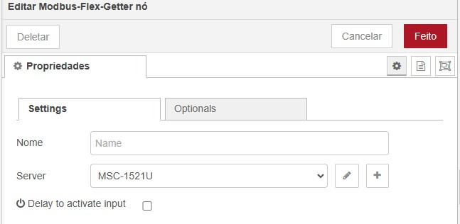
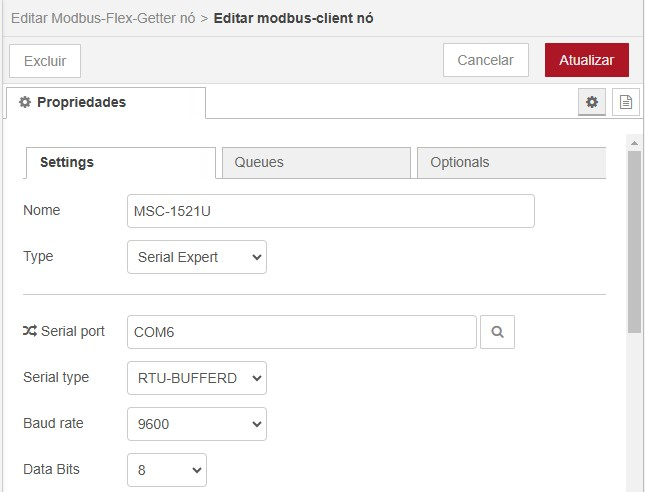
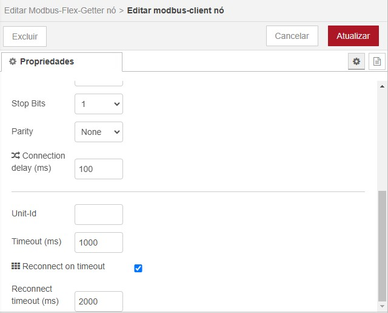
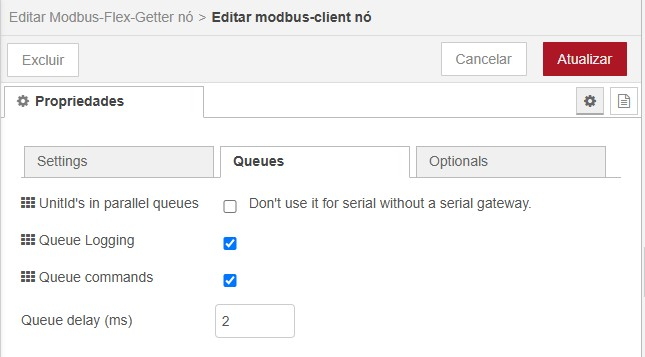
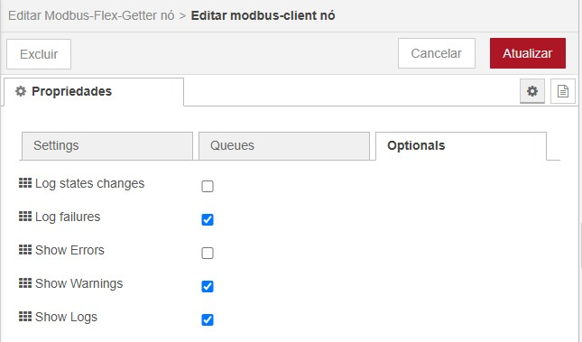
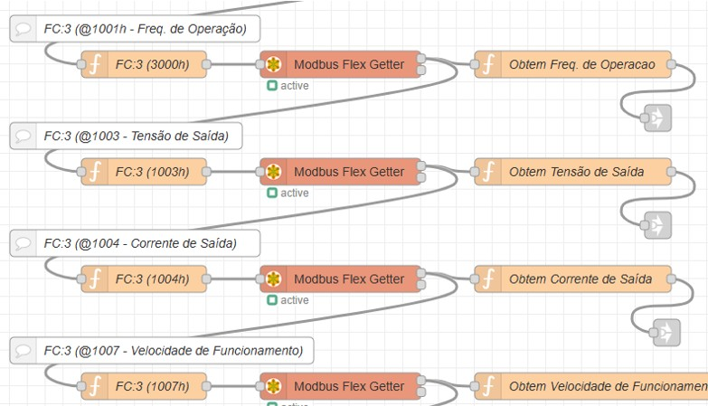
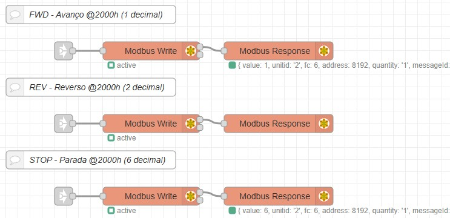
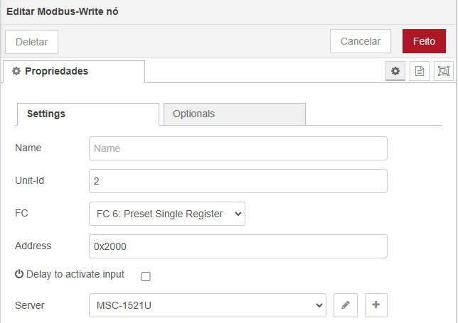

# Node-Red Dashboard para Controle de Inversor de Frequencia - Metaltex IF20

## Objetivo
Utilizar os recursos de dashboard do Node-Red para realizar o controle do Inversor de Frequencia - Metaltex IF20 via Modbus RTU / RS-485.


## Como funciona?

[](https://www.youtube.com/embed/khi3BISm9Wk)

## Arquivo JSON do Projeto

O arquivo do projeto pode ser obtido nesse mesmo diretório, ou através do link abaixo:

[modbus_flow.json](modbus_flows.json)

## Autor
- [Felipe Figueiredo Bezerra](https://github.com/FigFelipe)

## Ambiente de Desenvolvimento

- Node-RED version: v4.0.5
- Node.js  version: v22.12.0
- Dashboard version 3.6.5
- Windows_NT 10.0.26100 x64 LE

## Bibliotecas Node-Red

- node-red-contrib-modbus 5.43.0

## Arquitetura de Comunicação


## Hardware Utilizado

| Nome                                          |  Código             |
|-----------------------------------------------|---------------------|
| Conversor USB / Serial RS-232, RS-433, RS-485 | Metaltex MSC-1521U  |
| Inversor de Frequência                        | Metaltex IF20-201-1 |

## Parametrização do Inversor de Frequência IF20

O conjunto de parâmetros abaixo prepara o inversor de frequência para comunicar e ser controlado via Modbus RTU / RS-485.

| Parâmetro | Descrição | Valor |
|-----------|-----------|-------|
| Funções Básicas |
| P0.02 | Seleção da fonte de comando | 2: Controle via comunicação
| P0.04 | Seleção da frequência principal X | 9: Comunicação
| Parâmetros de Comunicação |
| PD.00 | Velocidade (baudrate) | 5: 9600bps |
| PD.01 | Formato do dado | 3: (sem paridade, formato <8,N,1> válido para Modbus) |
| PD.02 | Endereço Local (1 ao 249, 0 é broadcast) | 2 |
| PD.03 | Tempo de atraso na resposta (ms) | 2 |
| PD.04 | Tempo de limite de resposta | 0.0 |
| PD.05 | Seleção do protocolo Modbus | 1: Padrão do protocolo Modbus |
| PD.06 | Leitura da resolução de corrente | 1: 0.1A |

## Configurando o Conversor USB/Serial

### Gerenciador de Hardware - Windows

Identificamos o conversor USB Serial diretamente no gerenciador de dispositivos do Windows, através do nome Prolific PL2303GC.


Ir nas configurações de comunicação da porta, e modificar com os seguintes valores de parâmetros abaixo:

> Bits per second: 9600 |
> Data bits: 8 |
> Parity: None |
> Stop bits: 1 |
> Flow control: None

### Node-RED Dashboard - Modbus

É necessário configurar o conversor USB Serial no node-red, acessar através de um bloco *Modbus Flex Getter*:

> Nota: Para leitura de múltiplos registradores é ALTAMENTE recomendado utilizar o bloco do Modbus Flex Getter, pois é otimizado para tal função.

1. Na aba **Server**, configurar o conversor USB Serial:
   
   
   
   

3. Na aba **Queues**, configurar o método de consulta:

   > Nota: Desmarque a opção **'UnitId's in parallel queues'**, pois compromete o desempenho na comunicaçao Modbus RTU.
   
   

4. Na aba **Optionals**, pode-se configurar os logs de comunicação:
   
   
   

## Leitura do Registrador Modbus

Em resumo, a leitura de um registrador pode ser preparada através de um bloco de função. 

No modbus RTU, para que a requisição de múltiplos valores seja realizada com sucesso, é obrigatório encadear cada requisição conforme ilustrado na imagem abaixo.

 

### Preparando o conteúdo do Msg.payload

O conteúdo do 'bloco de função' pode ser consultado abaixo. No exemplo, o registrador retorna como resposta um único valor.

``` javascript
msg.payload = {
'fc': 3,             // Código da função modbus FC:3 (read register)
'unitid': 2,         // Endereço do dispositivo (slave id)
'address': 61441,    // F001h (base 16) sem offset de inicio zero, pode ser representado como 0xF001
'quantity': 1 } ;    // Quantidade de endereços a ser retornado como resposta, é possível também receber multiplos valores
return msg;
```

### Extraindo a resposta recebida do dispositivo

Toda a resposta do bloco Modbus Flex Getter é recebida no formato vetorizado. 

Para acessar o valor real recebido, é necessário extrair o valor do vetor através de um outro bloco de função. 

No caso do exemplo abaixo, é extraído o índice 0 (zero) do vetor de resposta.

``` javascript
var array = msg.payload;
msg.payload = array[0] / 100;
msg.topic = 'Freq. de Saída';
return msg;
```

## Escrita do Registrador Modbus

O método de escrita em um registrador é feito através do bloco 'Modbus Write' e não necessita obrigatoriamente do aguardo em fila de requisição para o envio da mensagem.



Acessar as configurações do bloco, informar o endereço do dispositivo, o endereço do registrador (hexadecimal ou decimal) e o servidor de comunicação (conversor usb serial), conforme ilustrado na imagem abaixo:



## Como escrever valores negativos via Modbus?

Em teoria, para escrever um valor em um determinado registrador, é necessário utilizar a função Modbus FC:6 (Preset Single Register). Esse registrador aceita somente valores positivos entre 0-65535 (2^16 - word).

Para o caso do inversor de frequencia, é possível controlar a velocidade em sentido horário (enviando o valor +10.000) e anti-horário (enviando o valor -10.000).

### Então como realizar o controle de sentido de rotação?

É necessário correlacionar a saída de valores conforme a tabela abaixo, considerando que:

* O limite da escala, entre 65535 e 55536, corresponde ao controle em sentido anti-horário do inversor de frequência.
* O início da escala, entre 0 e 10.000, corresponde ao controle em sentido horário do inversor de frequência.

| Valor Registrador (Modbus) | Freq. Saída | Valor Inversor | Sentido de Rotação |
| ------------------------ | ----------- | -------------- | ------------------ |
| 65535 | 0 Hz | 0 | Motor Parado |
| 60536 | -30 Hz | -5.000 | Anti-horário |
| 55536 | -60 Hz | -10.000 | Anti-horário |
| 10.000 | +60 Hz | +10.000 | Horário |
| 5.000 | +30 Hz | +5.000 | Horário |
| 0 | 0 Hz | 0 | Motor Parado |
