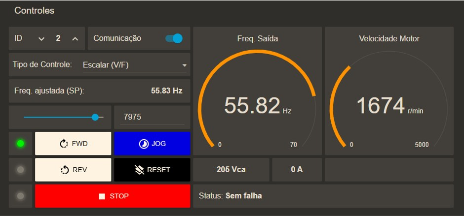
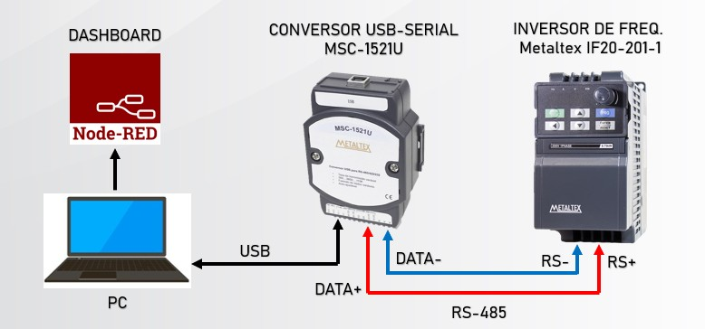
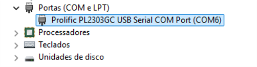

# Node-Red Dashboard para Controle de Inversor de Frequencia - Metaltex IF20

## Objetivo
Utilizar os recursos de dashboard do Node-Red para realizar o controle do Inversor de Frequencia - Metaltex IF20 via Modbus RTU / RS-485.

## Autor
- [Felipe Figueiredo Bezerra](https://github.com/FigFelipe)

## Ambiente de Desenvolvimento

- Node-RED version: v4.0.5
- Node.js  version: v22.12.0
- Dashboard version 3.6.5
- Windows_NT 10.0.26100 x64 LE

## Bibliotecas Node-Red

- node-red-contrib-modbus 5.43.0

## Arquitetura de Comunicação

## Hardware Utilizado

| Nome                                          |  Código             |
|-----------------------------------------------|---------------------|
| Conversor USB / Serial RS-232, RS-433, RS-485 | Metaltex MSC-1521U  |
| Inversor de Frequência                        | Metaltex IF20-201-1 |

## Parametrização do Inversor de Frequência IF20

O conjunto de parâmetros abaixo prepara o inversor de frequência para comunicar e ser controlado via Modbus RTU / RS-485.

| Parâmetro | Descrição | Valor |
|-----------|-----------|-------|
| Funções Básicas |
| P0.02 | Seleção da fonte de comando | 2: Controle via comunicação
| P0.04 | Seleção da frequência principal X | 9: Comunicação
| Parâmetros de Comunicação |
| PD.00 | Velocidade (baudrate) | 5: 9600bps |
| PD.01 | Formato do dado | 3: (sem paridade, formato <8,N,1> válido para Modbus) |
| PD.02 | Endereço Local (1 ao 249, 0 é broadcast) | 2 |
| PD.03 | Tempo de atraso na resposta (ms) | 2 |
| PD.04 | Tempo de limite de resposta | 0.0 |
| PD.05 | Seleção do protocolo Modbus | 1: Padrão do protocolo Modbus |
| PD.06 | Leitura da resolução de corrente | 1: 0.1A |

## Configurando o Conversor USB/Serial

### Gerenciador de Hardware - Windows

Identificamos o conversor USB Serial diretamente no gerenciador de dispositivos do Windows, através do nome Prolific PL2303GC.

Ir nas configurações de comunicação da porta, e modificar com os seguintes valores de parâmetros abaixo:

> Bits per second: 9600 |
> Data bits: 8 |
> Parity: None |
> Stop bits: 1 |
> Flow control: None

### Node-RED Dashboard - Modbus

É necessário configurar o conversor USB Serial no node-red, acessar através de um bloco *Modbus Flex Getter*:

> Nota: Para leitura de múltiplos registradores é ALTAMENTE recomendado utilizar o bloco do Modbus Flex Getter, pois é otimizado para tal função.

1. Na aba Server, configurar o conversor USB Serial:
   

3. Na aba Queue, configurar o método de requisição de pesquisa:

4. Na aba Optionals, pode-se configurar logs de comunicação:

   

## Leitura do Registrador Modbus

## Escrita do Registrador Modbus

## Como escrever valores negativos via Modbus?
